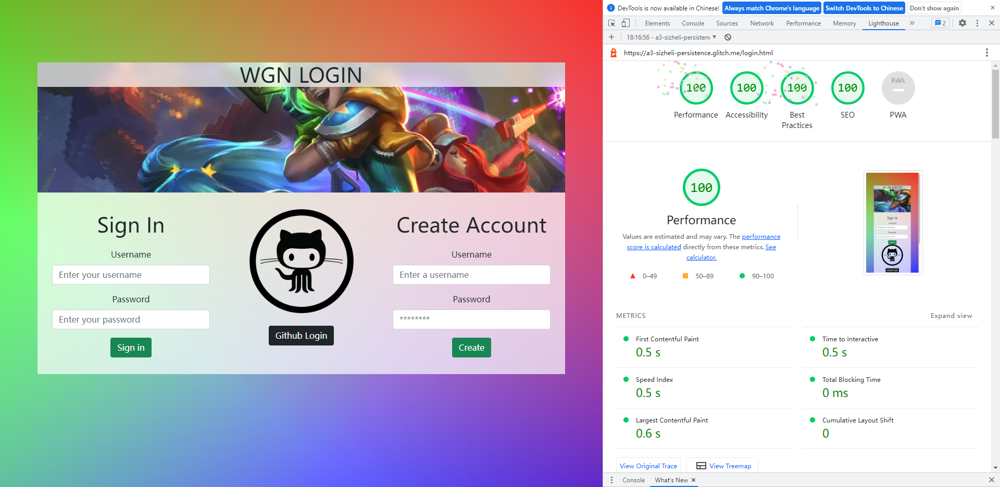
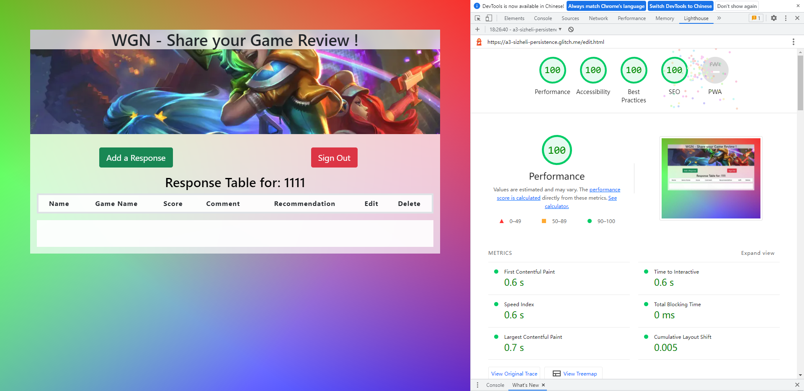

# Assignment 3 - Persistence: Two-tier Web Application with Database, Express server, and CSS template

## Project Link

Link: [https://a3-sizheli-persistence.glitch.me](https://a3-sizheli-persistence.glitch.me)

Test account: tester

Test password: 12345

This app is a website for sharing user reviews of any video game played. Users can manually enter relevant information to enter a game review, and the system will generate corresponding recommendations based on the player's score. Players can browse existing reviews directly by clicking on "see reviews" in the center of the screen. Users can also delete or edit their own published reviews.

I use a lot of CSS positioning techniques, including but not limited to: padding, margin, margin-left/right/top/bottom, display:flex,align-itms,height,weight,justify-content, text-align, vertical-align.
CSS framework I used was bootstrap 5.1.1.

Middleware used:

- serve-static to display login page on default
- express-session, to make sure a user doesn't have to log in every time
- cookie-seesion
- body-parser, to provide JSON flexibility for HTTP requests
- mongoose, to provide wrapper for accessing Mongo with a schema for survey response
- passport

- Persistent data storage in between server sessions using [mongodb](https://www.mongodb.com/cloud/atlas)

## Technical Achievements

- **Tech Achievement 1** (10 points): 
I used OAuth authentication via the GitHub strategy.
I also used OAuth authentication via providing a dummy account (your can register your own account.)
- **Tech Achievement 3** (5 points): Here are the lighthouse scores:

### Design/Evaluation Achievements

- **Design Achievement 1**:

1.  Provided sufficient contrast between foreground text and background colors so user can read.
2.  Provided clear and consistent navigation options for users to add/edit/delete responses
3.  Associated a label with every form control for response entry and edit
4.  Kept content clear and concise, when adding response, only add form shows up; same for editing
5.  Provided easily identifiable feedback: when user does not enter all fields, warning window pops up
6.  Provide informative, unique page titles - my pages have title associated with the content, such as login, response table, edit table
7.  Ensure that all interactive elements are keyboard accessible - You may use tab and enter to navigate the website
8.  Ensure that form elements include clearly associated labels - The labels and placeholders to the all input fields clearly tell you what you should input
9.  Ensure that interactive elements are easy to identify - in login and register page, the sign-in and create buttons really stand out with a green color on a frosted glass. Same for the edit page.
10. Use headings to convey meaning and structure:Use short headings to group related paragraphs and clearly describe the sections, include separate response area and response table on edit page; login and register section on login page
11. Write meaningful text alternatives for images
12. Associate a label with every form control-The labels used in the website basically follow this principle
